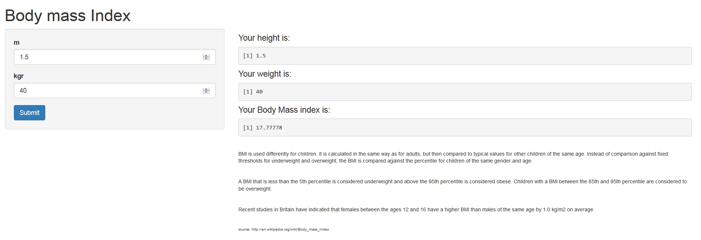

Body Mass Index Calculation
========================================================

\[bmi = ((weight)/(height)^2)\]

  

How to use this app?
========================================================

You may enter your height and weight in order to see your calculated BMI
  
Screenshot
========================================================

Cheers!

